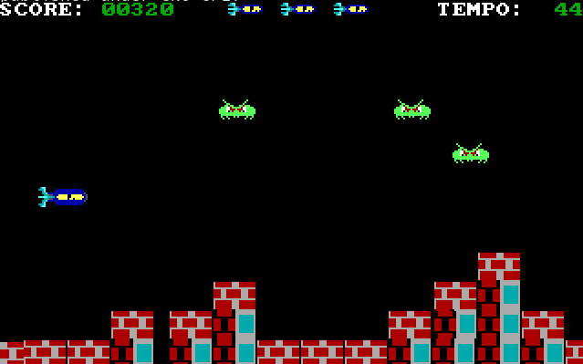

# Scramble
game written in Intel 8086 Assembly, inspired by the classic arcade game Scramble, originally developed by Konami in 1981

use the arrow keys to move and the space bar to shoot

  

references:
- https://en.wikipedia.org/wiki/Entity_component_system
- https://tutorialedge.net/gamedev/aabb-collision-detection-tutorial/
- https://www.dosbox.com/DOSBoxManual.html

